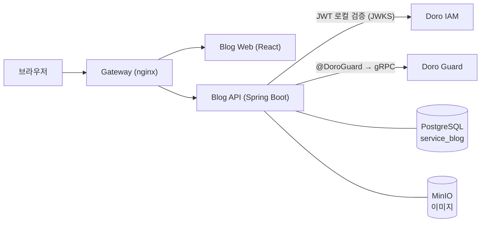

# 📝 Doro Blog

[](https://github.com/yu-teacher/doro-blog/actions/workflows/ci.yml)

> **English summary** — A Velog-style technical blogging platform (Spring Boot 4 / React 19) and the first service built on my own identity & authorization platform, **[Doro](https://github.com/yu-teacher/doro)**. Login and permissions are delegated to Doro (OAuth 2.1 + PKCE through a BFF that keeps tokens on the server and gives the browser only an HttpOnly session cookie; authorization through a Zanzibar-style ReBAC engine), so role rules are declared in a schema instead of being scattered as `if` statements. I used it as a testbed for production-grade backend practices: lock-free atomic counters, idempotent writes, trigram-indexed search, a defense-in-depth file-upload pipeline (magic-byte detection, an allow-list SVG sanitizer, sandboxing CSP), scoped API keys, and a scripted deploy that snapshots a rollback point before every release. **532 automated tests** (282 backend + 250 frontend).

마크다운으로 글을 쓰고, 시리즈로 묶고, 댓글로 소통하는 **기술 블로그 서비스**입니다.
직접 만든 인증·인가 플랫폼 **[Doro](https://github.com/yu-teacher/doro)** 위에서 동작하는 첫 번째 서비스이고, 로그인 화면과 비밀번호 처리, 권한 규칙은 이 서비스 안에 없습니다. 이 서비스는 OAuth 코드 교환을 맡는 BFF 세션 계층만 갖고, 권한 규칙은 Guard 스키마에 선언합니다.

| | |
|---|---|
| **✍️ 글쓰기** | 마크다운 에디터, 임시저장 자동 저장, 공개/비공개/임시, 썸네일, 태그 |
| **📚 시리즈** | 글을 회차별로 묶는 연재(목차), 순서 일괄 정렬 |
| **💬 소통** | 2단계 대댓글(삭제된 부모는 "삭제된 댓글입니다"), 좋아요, 팔로우, 알림 |
| **🔎 발견** | 트렌딩(일/주/월/년), 태그별 모아보기, 제목·요약·본문 검색 |
| **🧑‍💻 개발자** | 범위가 제한된 API 키로 글·시리즈·태그·업로드를 자동화 |

---

## 🧠 설계에서 신경 쓴 것

### 1. 권한은 코드가 아니라 데이터로 — Doro Guard
글·시리즈·댓글의 모든 권한 판단을 Guard에 위임합니다. 예를 들어 "댓글을 지울 수 있는 사람"은 **댓글 작성자 또는 그 댓글이 달린 글의 작성자**인데, 그 규칙을 스키마 한 줄로 선언합니다. 서비스 코드는 흔한 경우(내 댓글, 내 글)를 먼저 확인하고 최종 판정은 Guard에 맡깁니다.

```text
type blog_comment {
  relation author: user
  relation post: blog_post
  relation can_delete: author | post#author       # 작성자 ∪ (달린 글의 작성자)
}
```
글·시리즈의 수정/삭제는 컨트롤러에 어노테이션 한 줄로 걸고, 댓글 삭제처럼 서비스 흐름 안에서 판단해야 할 때는 Guard에 직접 묻습니다.

```java
@DoroGuard(namespace = "blog_post", object = "#postId", relation = "editor")   // 글 수정/삭제 컨트롤러
...
guardClient.check("blog_comment", commentId, "can_delete", currentUserId)       // 댓글 삭제 서비스
```
- **DB와 Guard의 일관성**: 튜플을 쓰다 실패하면 예외를 던져 DB 트랜잭션도 롤백하고(이미 쓴 튜플은 정리), 삭제는 커밋이 확정된 뒤에 합니다(`GuardTuples`). 그래서 권한 없는 글이 생기지 않습니다. 커밋 뒤 삭제가 실패해도 요청은 성공시키고 ERROR 로그로 남겨 추적합니다. Guard 장애는 `503`으로 응답합니다.
- **스키마 병합 등록**: 기동할 때 Guard의 활성 스키마에서 **없는 블로그 타입만** 덧붙입니다. 다른 서비스의 규칙을 덮어쓰지 않으며, 여러 번 실행해도 결과가 같습니다.
- **회귀 방지**: 소스를 스캔해 코드가 쓰는 모든 튜플·판정이 스키마에 선언돼 있는지 검사하는 테스트가 있습니다.

### 2. 동시성: 읽고-더하고-저장하지 않기
조회수·좋아요·댓글·팔로워 수는 `UPDATE … SET n = n + 1` **한 문장으로 DB가 원자적으로** 올립니다. 좋아요·팔로우는 `INSERT … ON CONFLICT DO NOTHING`의 반영 행 수로 중복 요청을 판단해, 더블클릭에도 숫자가 틀어지지 않습니다. 동시 요청 테스트로 유실이 없음을 검증합니다.

### 3. 검색 성능: 인덱스를 실제로 타게
제목·요약·본문 검색은 PostgreSQL `pg_trgm` GIN 인덱스를 씁니다. `LIKE` 패턴을 애플리케이션에서 만들어 `ESCAPE`와 함께 넘기는 방식으로 바꿔서, 플래너가 세 인덱스를 함께 쓰는 것(`BitmapOr`)을 `EXPLAIN`으로 확인했습니다. 목록 API의 쿼리 수는 테스트로 고정해 N+1 회귀를 막습니다.

### 4. 파일 업로드: 한 겹이 아니라 세 겹
| 방어 | 내용 |
|---|---|
| **내용 기반 판별** | 확장자나 `Content-Type`을 믿지 않고 **매직 바이트**로 형식을 판별. 위장 파일(`.png`로 올린 SVG 등)은 거부 |
| **SVG 허용 목록 정제** | 원본을 저장하지 않고, 허용된 요소·속성만 새 문서로 복사. `script`, `on*` 이벤트, 외부 참조 제거, DOCTYPE 금지(XXE·엔티티 폭탄 차단) |
| **격리된 서빙** | 게이트웨이가 업로드 파일 응답에 `default-src 'none'; style-src 'unsafe-inline'; img-src 'self' data:; sandbox` CSP와 `nosniff`를 걸고 버킷 목록 조회를 막아, 직접 열어도 스크립트가 실행되지 않음 |

실제 MinIO를 대상으로 하는 통합 테스트가 있고, 정제기를 일부러 약하게 만들면 실패하는 것도 확인했습니다.

### 5. API 키는 최소 권한으로
키는 `posts`, `series`, `tags`, `uploads` 범위에서 **조회·작성·수정(GET/POST/PUT/PATCH)만** 할 수 있습니다. 삭제와 그 밖의 범위는 `403`이라, 키가 유출돼도 글을 지울 수 없습니다. 오류 응답은 모든 경로(필터 포함)에서 같은 형식(`success`, `code`, `message`, `status` 등)입니다.

### 6. 배포와 마이그레이션
- **Flyway** 11개 마이그레이션(V1~V11), `ddl-auto: validate`, 서비스 전용 DB(`service_blog`)
- **배포 스크립트**(`scripts/deploy.sh`, 로컬에서 실행): 테스트 → 빌드 → **롤백 스냅샷(이전 jar·이미지)** → DB 백업 → 전송 → 재기동 → 헬스체크. 헬스체크가 실패하면 중단하고 복구 방법을 안내하며, 되돌릴 지점은 배포 전에 항상 남깁니다.
- **서버 배포**(`scripts/deploy-on-server.sh`, CI 통과 커밋만 자체 호스팅 러너가 실행): 컨테이너 안에서 빌드 → 스냅샷·DB 백업 → 반영 → 헬스체크 → 게이트웨이 reload(재생성된 컨테이너 IP 재해석), 실패하면 **직전 릴리스로 자동 복구**합니다.

### 7. 로그인과 회원 탈퇴
- **로그인(OAuth BFF)**: 인가 코드 + PKCE(S256)를 **블로그 서버가 교환**하고, 토큰은 AES-256-GCM으로 암호화해 서버(DB)에만 둡니다. 브라우저에는 `HttpOnly`·`Secure`·`SameSite=Lax` 세션 쿠키만 주고, 상태를 바꾸는 요청에는 커스텀 CSRF 헤더(와 `Origin` 검사)를 요구합니다. 로그인 콜백은 **로그인을 시작한 그 브라우저**에서만 끝낼 수 있게 묶어(남이 시작한 로그인을 피해자에게 끝내게 하는 로그인 CSRF 방지), Doro가 잠시 응답하지 않아도 사용자의 세션은 지우지 않습니다. 프런트엔드에는 로그인 폼과 토큰 저장 코드가 없습니다.
- **회원 탈퇴**: Doro가 30일 유예(비밀번호 재입력, 유예 중 로그인하면 취소) 뒤 계정을 익명화하고, 블로그는 **탈퇴한 사용자 ID 목록을 주기적으로 조회(pull)** 해서 자기 개인정보 사본을 익명화합니다. 이 내부 API는 게이트웨이를 거치지 않는 내부 네트워크 전용이고, **호출자 서비스 토큰**(헤더 `X-Doro-Service-Token`)으로 한 번 더 지킵니다. 글과 댓글은 "탈퇴한 사용자"로 남기고 API 키·BFF 세션·본인 알림·팔로우는 지웁니다(멱등, 조회 커서는 겹쳐 읽어 누락을 막음).

---

## 🏗️ 구조



**백엔드** Java 25 · Spring Boot 4.1 · JPA · Flyway · Doro SDK
**프런트엔드** React 19 · Vite · TypeScript · zustand · vitest — 화면 로직은 훅(`usePaginatedList`, `useDraftAutosave` 등)과 순수 함수로 분리해 단위 테스트합니다.

## 🧪 테스트
백엔드 **282개**(단위·통합·동시성·쿼리 수·실제 MinIO) + 프런트엔드 **250개**, ESLint·타입 검사 통과.
`main` 푸시와 PR 마다 GitHub Actions 가 프런트(린트·타입·테스트·빌드)와, 격리된 Postgres·Redis·Guard 스택과 S3 호환 목 서버 위에서 백엔드 통합 테스트를 돌립니다(`scripts/ci-test.sh` 로 로컬에서도 동일하게 재현).

## 🚀 실행
```bash
# 백엔드 (DB/MinIO/Doro 가 떠 있어야 합니다)
DB_PASSWORD=... MINIO_SECRET_KEY=... ./gradlew bootRun
./gradlew test                       # 백엔드 테스트

# 프런트엔드
cd web && npm install && npm run dev
```
API 문서는 실행 후 `http://localhost:8082/swagger-ui.html` 에서 볼 수 있습니다.

## 🛠️ 주요 REST API
| | |
|---|---|
| 글 | `POST /api/v1/posts`, `GET /api/v1/posts`(피드), `/search`, `/trending`, `/@{username}/{slug}`, `PUT·DELETE /{id}` |
| 시리즈 | `POST /api/v1/series`, `GET /series/{id}`, `PUT /series/{id}/sort` |
| 댓글·좋아요 | `POST /posts/{id}/comments`(+ `/replies`), `DELETE /comments/{id}`, `POST /posts/{id}/likes` |
| 사용자 | `GET /users/@{username}`, `PUT /users/me`, `POST /users/@{username}/follow` |
| 업로드·태그 | `POST /api/v1/uploads`, `GET /api/v1/tags` |
