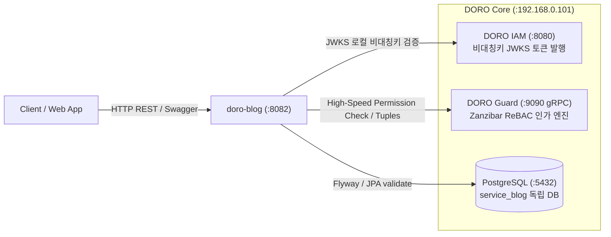

# 📝 DORO Blog (Velog-style Publishing Microservice)

> **DORO Platform** 생태계의 첫 번째 공식 서브 마이크로서비스:  
> 벨로그(Velog) 스타일의 오픈 기술 블로그, 목차 연재 시리즈(Series), 2-Level 계층형 대댓글, 그리고 구글 Zanzibar ReBAC 인가 시스템을 탑재한 퍼블리싱 플랫폼 API.

---

## 🏛️ 시스템 아키텍처 및 DORO 생태계 통합



- **Database-per-Service**: 중앙 PostgreSQL 내 독립 데이터베이스 `service_blog` 격리 운용
- **Flyway 마이그레이션**: `blog_schema_history` 메타 테이블 격리 및 Hibernate `ddl-auto: validate`
- **ReBAC 인가 (@DoroGuard)**: if문 권한 분기 하드코딩 없이 Zanzibar DSL 및 SpEL 기반 선언적 권한 검증

---

## 📚 핵심 도메인 모델

1. **`BlogUser` (작가 & 블로그 채널)**
   - DORO IAM의 UUID와 1:1 매핑 및 첫 요청 시 JIT(Just-In-Time) 자동 프로비저닝
   - 고유 채널 주소 `/@{username}`, 닉네임, 한 줄 소개(`bio`), 블로그 타이틀(`{nickname}.log`), 소셜 링크 관리
2. **`Series` (연재 출간 시리즈)**
   - 글들을 회차별(`series_order`)로 묶어 연재집(책)처럼 출간하는 컬렉션
   - 작가별 슬러그 복합 유니크 `(user_id, slug)`, 목차 순서 일괄 정렬(`reorderPosts`) 지원
3. **`Post` (마크다운 아티클 & 출간)**
   - 본문 마크다운 원문, 썸네일, 슬러그, 발행 상태(`DRAFT`, `PUBLISHED`, `PRIVATE`)
   - 조회수(`view_count`), 좋아요(`like_count`), 댓글(`comment_count`) 실시간 집계
4. **`Comment` & `Reply` (2-Level 계층형 대댓글)**
   - `parent_id` 자기참조(Self-Reference) 외래키를 통한 루트 댓글 및 대댓글(답글) 구분
   - **안정적 소프트 삭제(`is_deleted = true`)**: 자식 대댓글이 존재하는 부모 댓글은 *"삭제된 댓글입니다"*로 표시
   - **원글 작성자 삭제 권한 (ReBAC)**: 댓글 작성자 본인 뿐만 아니라 해당 글의 작성자(`post#author`)도 삭제 권한 보유
5. **`Tag` & `PostTag` (분류 및 통계)**
   - RDB 다대다 정규 구조로 정렬, 페이징, 인기 태그 랭킹(`findTop30ByOrderByPostCountDesc`) 고속 처리
6. **`PostLike` (좋아요 토글)**
   - `(post_id, user_id)` 복합 유니크 제약 기반 1인 1좋아요 토글

---

## 🛡️ DORO Guard Zanzibar ReBAC 스키마 (`blog-schema.doro`)

```text
type blog_series {
  relation owner: user
  relation editor: owner
  relation viewer: user | editor
}

type blog_post {
  relation author: user
  relation series: blog_series
  relation editor: author
  relation viewer: author | user
}

type blog_comment {
  relation author: user
  relation post: blog_post
  relation editor: author
  relation can_delete: author | post#author
}
```

---

## 🚀 REST API 엔드포인트 요약

| 도메인 | 메서드 | URI | 설명 | 인가 |
| :--- | :---: | :--- | :--- | :---: |
| **User** | `GET` | `/api/v1/users/@{username}` | 작가 프로필 조회 | Public |
| | `GET` | `/api/v1/users/me` | 내 프로필 조회 및 JIT 프로비저닝 | Authenticated |
| | `PUT` | `/api/v1/users/me` | 내 프로필(bio, 타이틀, 링크) 수정 | Authenticated |
| | `PUT` | `/api/v1/users/me/username` | 내 username 슬러그 변경 | Authenticated |
| **Series** | `POST` | `/api/v1/series` | 새 시리즈 생성 | Authenticated |
| | `GET` | `/api/v1/series/users/@{username}` | 작가의 시리즈 목록 조회 | Public |
| | `GET` | `/api/v1/series/{seriesId}` | 시리즈 상세 및 소속 글 목록 | Public |
| | `PUT` | `/api/v1/series/{seriesId}` | 시리즈 수정 | `@DoroGuard` editor |
| | `DELETE` | `/api/v1/series/{seriesId}` | 시리즈 삭제 | `@DoroGuard` editor |
| | `PUT` | `/api/v1/series/{seriesId}/sort` | 시리즈 내 글 순서 일괄 정렬 | `@DoroGuard` editor |
| **Post** | `POST` | `/api/v1/posts` | 새 글 작성 / 출간 / 임시저장 | Authenticated |
| | `GET` | `/api/v1/posts` | 전체 피드 (최신순/인기순/태그필터) | Public |
| | `GET` | `/api/v1/posts/users/@{username}` | 작가의 출간 글 목록 | Public |
| | `GET` | `/api/v1/posts/@{username}/{slug}` | 글 상세 조회 (마크다운 원문) | Public / ReBAC |
| | `PUT` | `/api/v1/posts/{postId}` | 글 수정 | `@DoroGuard` editor |
| | `DELETE` | `/api/v1/posts/{postId}` | 글 삭제 | `@DoroGuard` editor |
| **Comment** | `POST` | `/api/v1/posts/{postId}/comments` | 루트 댓글 작성 | Authenticated |
| | `POST` | `/api/v1/posts/{postId}/comments/{commentId}/replies` | 대댓글(답글) 작성 (2-Level) | Authenticated |
| | `GET` | `/api/v1/posts/{postId}/comments` | 계층형 댓글 트리 조회 | Public |
| | `PUT` | `/api/v1/comments/{commentId}` | 댓글 수정 | Author only |
| | `DELETE` | `/api/v1/comments/{commentId}` | 댓글 삭제 (소프트삭제 지원) | `@DoroGuard` can_delete |
| **Like** | `POST` | `/api/v1/posts/{postId}/likes` | 좋아요 토글 (1인 1좋아요) | Authenticated |
| **Tag** | `GET` | `/api/v1/tags` | 인기 태그 및 글 개수 랭킹 | Public |

---

## 🛠️ 빌드 및 실행 방법

### 빌드 및 테스트
```bash
./gradlew clean test
```

### 로컬 애플리케이션 기동
```bash
./gradlew bootRun
```

### Swagger 3.0 UI 접속
- `http://localhost:8082/swagger-ui.html`
