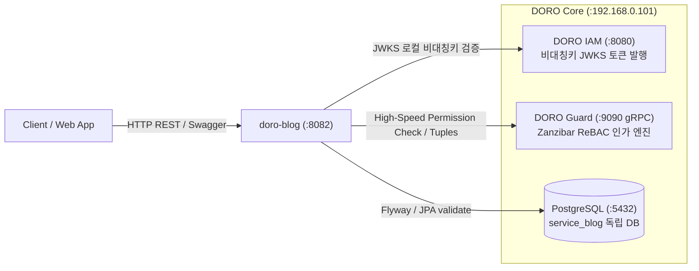

# 📝 DORO Blog (Velog-style Publishing Microservice)

> **DORO Platform** 생태계의 첫 번째 공식 서브 마이크로서비스:  
> 벨로그(Velog) 스타일의 오픈 기술 블로그, 목차 연재 시리즈(Series), 2-Level 계층형 대댓글, 그리고 구글 Zanzibar ReBAC 인가 시스템을 탑재한 퍼블리싱 플랫폼 API.

---

## 🏛️ 시스템 아키텍처 및 DORO 생태계 통합



- **Database-per-Service**: 중앙 PostgreSQL 내 독립 데이터베이스 `service_blog` 격리 운용
- **Flyway 마이그레이션**: `blog_schema_history` 메타 테이블 격리 및 Hibernate `ddl-auto: validate`
- **ReBAC 인가 (@DoroGuard)**: if문 권한 분기 하드코딩 없이 Zanzibar DSL 및 SpEL 기반 선언적 권한 검증

---

## 📚 핵심 도메인 모델

1. **`BlogUser` (작가 & 블로그 채널)**
   - DORO IAM의 UUID와 1:1 매핑 및 첫 요청 시 JIT(Just-In-Time) 자동 프로비저닝
   - 고유 채널 주소 `/@{username}`, 닉네임, 한 줄 소개(`bio`), 블로그 타이틀(`{nickname}.log`), 소셜 링크 관리
2. **`Series` (연재 출간 시리즈)**
   - 글들을 회차별(`series_order`)로 묶어 연재집(책)처럼 출간하는 컬렉션
   - 작가별 슬러그 복합 유니크 `(user_id, slug)`, 목차 순서 일괄 정렬(`reorderPosts`) 지원
3. **`Post` (마크다운 아티클 & 출간)**
   - 본문 마크다운 원문, 썸네일, 슬러그, 발행 상태(`DRAFT`, `PUBLISHED`, `PRIVATE`)
   - 조회수(`view_count`), 좋아요(`like_count`), 댓글(`comment_count`) 실시간 집계
4. **`Comment` & `Reply` (2-Level 계층형 대댓글)**
   - `parent_id` 자기참조(Self-Reference) 외래키를 통한 루트 댓글 및 대댓글(답글) 구분
   - **안정적 소프트 삭제(`is_deleted = true`)**: 자식 대댓글이 존재하는 부모 댓글은 *"삭제된 댓글입니다"*로 표시
   - **원글 작성자 삭제 권한 (ReBAC)**: 댓글 작성자 본인 뿐만 아니라 해당 글의 작성자(`post#author`)도 삭제 권한 보유
5. **`Tag` & `PostTag` (분류 및 통계)**
   - RDB 다대다 정규 구조로 정렬, 페이징, 인기 태그 랭킹(`findTop30ByOrderByPostCountDesc`) 고속 처리
6. **`PostLike` (좋아요 토글)**
   - `(post_id, user_id)` 복합 유니크 제약 기반 1인 1좋아요 토글

---

## 🛡️ DORO Guard Zanzibar ReBAC 스키마 (`blog-schema.doro`)

```text
type blog_series {
  relation owner: user
  relation editor: owner
  relation viewer: user | editor
}

type blog_post {
  relation author: user
  relation series: blog_series
  relation editor: author
  relation viewer: author | user
}

type blog_comment {
  relation author: user
  relation post: blog_post
  relation editor: author
  relation can_delete: author | post#author
}

type blog_user {
  relation follower: user      # 팔로우 기록 (쓰기 전용, 판정에는 쓰지 않음)
}
```

**스키마 등록은 안전한 병합으로 합니다.** Guard의 스키마 등록은 "전체 교체"라서, 기동할 때 `BlogSchemaInitializer`가 Guard의 활성 스키마를 읽어 **없는 블로그 타입만 뒤에 덧붙여**(`BlogSchemaMerger`) 다시 등록합니다. 기존 타입(IAM·다른 서비스 포함)은 한 글자도 바꾸지 않고, 이미 다 있으면 아무 것도 하지 않으며(재기동해도 버전이 늘지 않음), 이름이 같은데 내용이 다른 블로그 타입은 바꾸지 않고 경고만 남깁니다. 이 호출에는 서비스 토큰의 `schema-write` 권한이 필요합니다.

**코드와 스키마가 어긋나지 않도록** `BlogSchemaCoversUsedTuplesTest`가 소스를 스캔해, 코드가 쓰는 모든 튜플·`check`·`@DoroGuard`의 (타입, 릴레이션)이 이 파일에 선언돼 있는지 검사합니다. Guard의 검증 모드가 `ENFORCE`이면 선언되지 않은 튜플은 거부되고 `GuardTuples.write`가 예외를 던져 글·댓글 저장까지 롤백되므로, 튜플을 새로 쓰는 코드를 추가하면 스키마에도 선언해야 합니다.

---

## 🚀 REST API 엔드포인트 요약

| 도메인 | 메서드 | URI | 설명 | 인가 |
| :--- | :---: | :--- | :--- | :---: |
| **User** | `GET` | `/api/v1/users/@{username}` | 작가 프로필 조회 | Public |
| | `GET` | `/api/v1/users/me` | 내 프로필 조회 및 JIT 프로비저닝 | Authenticated |
| | `PUT` | `/api/v1/users/me` | 내 프로필(bio, 타이틀, 링크) 수정 | Authenticated |
| | `PUT` | `/api/v1/users/me/username` | 내 username 슬러그 변경 | Authenticated |
| **Series** | `POST` | `/api/v1/series` | 새 시리즈 생성 | Authenticated |
| | `GET` | `/api/v1/series/users/@{username}` | 작가의 시리즈 목록 조회 | Public |
| | `GET` | `/api/v1/series/{seriesId}` | 시리즈 상세 및 소속 글 목록 | Public |
| | `PUT` | `/api/v1/series/{seriesId}` | 시리즈 수정 | `@DoroGuard` editor |
| | `DELETE` | `/api/v1/series/{seriesId}` | 시리즈 삭제 | `@DoroGuard` editor |
| | `PUT` | `/api/v1/series/{seriesId}/sort` | 시리즈 내 글 순서 일괄 정렬 | `@DoroGuard` editor |
| **Post** | `POST` | `/api/v1/posts` | 새 글 작성 / 출간 / 임시저장 | Authenticated |
| | `GET` | `/api/v1/posts` | 전체 피드 (최신순/인기순/태그필터) | Public |
| | `GET` | `/api/v1/posts/me` | 내 포스트 관리 목록 (status: ALL, DRAFT, PUBLISHED, PRIVATE, 페이징) | Authenticated |
| | `GET` | `/api/v1/posts/trending` | 트렌딩 포스트 기간별 조회 (day, week, month, year, 페이징) | Public |
| | `GET` | `/api/v1/posts/me/likes` | 내가 좋아요한 포스트 목록 (페이징) | Authenticated |
| | `GET` | `/api/v1/posts/search` | 키워드 검색 (제목/요약/본문 대소문자 무관, 페이징) | Public |
| | `GET` | `/api/v1/posts/users/@{username}` | 작가의 출간 글 목록 (페이징) | Public |
| | `GET` | `/api/v1/posts/@{username}/{slug}` | 글 상세 조회 (마크다운 원문) | Public / ReBAC |
| | `PUT` | `/api/v1/posts/{postId}` | 글 수정 | `@DoroGuard` editor |
| | `DELETE` | `/api/v1/posts/{postId}` | 글 삭제 | `@DoroGuard` editor |
| **Comment** | `POST` | `/api/v1/posts/{postId}/comments` | 루트 댓글 작성 | Authenticated |
| | `POST` | `/api/v1/posts/{postId}/comments/{commentId}/replies` | 대댓글(답글) 작성 (2-Level) | Authenticated |
| | `GET` | `/api/v1/posts/{postId}/comments` | 계층형 댓글 트리 조회 | Public |
| | `PUT` | `/api/v1/comments/{commentId}` | 댓글 수정 | Author only |
| | `DELETE` | `/api/v1/comments/{commentId}` | 댓글 삭제 (소프트삭제 지원) | `@DoroGuard` can_delete |
| **Like** | `POST` | `/api/v1/posts/{postId}/likes` | 좋아요 토글 (1인 1좋아요) | Authenticated |
| **Tag** | `GET` | `/api/v1/tags` | 인기 태그 및 글 개수 랭킹 | Public |

---

## 🔐 보안 설계

- **업로드 3중 방어**
  1. *내용 기반 형식 판별*: 확장자/Content-Type을 믿지 않고 매직 바이트로 jpeg·png·gif·webp·svg를 판별하며, 확장자가 판별 결과와 다르면 거부합니다. 저장 폴더는 허용 목록(`posts`, `thumbnails`)만 받습니다.
  2. *SVG 허용 목록 정제(`SvgSanitizer`)*: 원본을 저장하지 않고, 허용된 요소·속성만 새 문서로 복사해 저장합니다. `script`, `foreignObject`, `on*` 이벤트, `javascript:`·외부 `href`/`url()`, 위험한 CSS를 제거하고, DOCTYPE은 XXE·엔티티 폭탄 방지를 위해 파싱 단계에서 금지합니다. 크기·깊이·노드 수에도 상한이 있습니다.
  3. *게이트웨이 격리*: `/media/` 응답에 `default-src 'none'; sandbox` CSP를 걸어, 업로드 파일을 직접 열어도 스크립트가 실행되지 않습니다.
- **API 키 스코프(`ApiKeyScope`)**: 키는 `/api/v1/posts`, `/series`, `/tags`, `/uploads`만 호출할 수 있고, 그 밖의 경로는 `403 AUTH-403-02`입니다.
- **Guard 정합성(`GuardTuples`)**: 권한 튜플은 쓰기 실패 시 예외를 던져 트랜잭션을 롤백하고, 삭제는 커밋 이후에 수행합니다. Guard 장애는 `503 SYS-503-01`로 응답합니다.
- **표준 에러 봉투**: 모든 오류는 `GlobalExceptionHandler`를 거쳐 `{ success:false, code, message, status }`로 응답합니다(필터에서 나는 401/403 포함).

## ⚙️ 동시성 및 성능

- **원자적 카운터**: 조회수·좋아요·댓글·팔로우·태그·시리즈 집계는 읽고-더하고-저장하지 않고 `UPDATE ... SET n = n + 1` 단일 SQL로 갱신합니다(`PostCounterService`). 동시 요청 테스트(`BlogCounterConcurrencyTests`)로 유실이 없음을 검증합니다.
- **멱등 쓰기**: 좋아요·팔로우는 `INSERT ... ON CONFLICT DO NOTHING`의 반영 행 수로 중복 요청을 판단합니다.
- **검색 인덱스**: 제목·요약·본문 검색은 `pg_trgm` GIN 인덱스(V7)를 타도록 LIKE 패턴을 애플리케이션에서 만들어 `ESCAPE '!'`와 함께 전달합니다. `EXPLAIN`으로 세 인덱스의 BitmapOr 사용을 확인했습니다.
- **N+1 방지**: `BlogQueryCountTests`로 목록 API의 쿼리 수를 고정해 회귀를 막습니다.
- **입력 한도 정합**: DTO 검증 길이와 DB 컬럼 길이를 맞췄고(`DtoLimitsTest`), 알림 제목·메시지는 컬럼 길이에 맞춰 잘라 저장합니다. 페이지 크기는 `PageLimits`로 상한(100)을 둡니다.

## 🧪 테스트 및 배포

- **백엔드**: 단위·통합·동시성 테스트. 업로드는 실제 MinIO에 대해 통합 테스트(`SvgUploadIntegrationTest`)를 수행합니다.
- **프런트엔드**: vitest(jsdom) + ESLint(flat config) + `tsc -b`. 화면 로직은 `usePaginatedList`, `useAsyncResource`, `useDraftAutosave` 등 훅과 순수 함수로 분리해 단위 테스트합니다.
- **배포**: `scripts/deploy.sh`가 테스트 → 빌드 → 롤백 스냅샷(이전 jar/dist, 이미지 태그) → DB 백업 → 전송 → 재기동 → 헬스체크 순서로 진행합니다. `--dry-run`으로 서버 상태만 점검할 수 있습니다.

---

## 🛠️ 빌드 및 실행 방법

### 빌드 및 테스트
```bash
./gradlew clean test
```

### 로컬 애플리케이션 기동
운영 설정에는 기본 비밀번호가 없으므로 `DB_PASSWORD`, `MINIO_SECRET_KEY`를 환경변수로 지정해야 합니다(`.env.example` 참고). 테스트(`./gradlew test`)는 로컬 docker 개발용 값을 자동으로 주입합니다.
```bash
DB_PASSWORD=... MINIO_SECRET_KEY=... ./gradlew bootRun
```

### Swagger 3.0 UI 접속
- `http://localhost:8082/swagger-ui.html`
